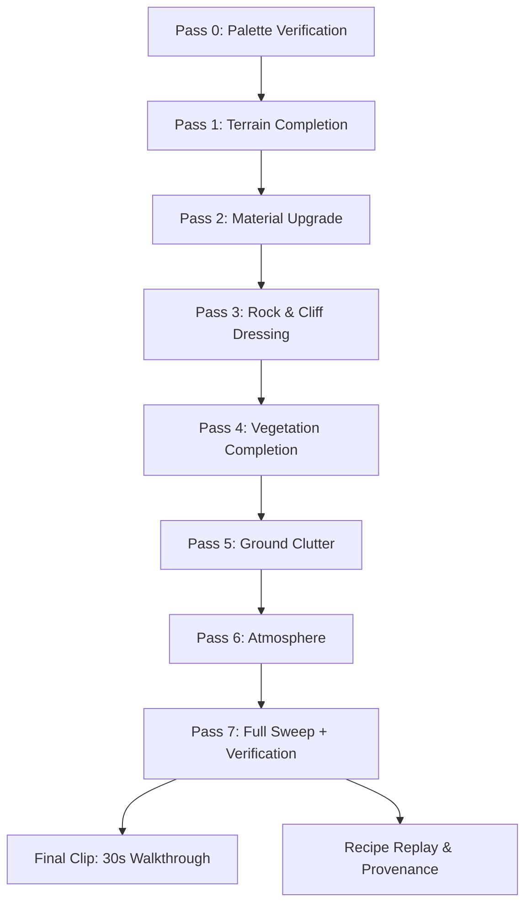

> # ⛔ SUPERSEDED — describes the pre-8K / pre-kit design. Do not apply.
>
> Quarantined 2026-08-29 by the doc-consolidation unit. **Nothing in this
> file may drive a decision.** It is kept verbatim because this project
> never deletes a record; the content below the banner is byte-identical to
> what it was before the move.
>
> **Why it is dead.** Its Pass 0 runs a cold replay on
> `recipes/alpine_palette_curation.json` / `recipes/alpine.json` — the
> **pre-8K** recipe pair. The Pass 0–7 campaign it plans ran to completion
> on `/Game/Alpine` and the world then moved to `/Game/Alpine8K`.
>
> **Note also:** `VERIFICATION.md` was once rewritten FROM this file, which
> turned its planned steps into claimed completions. A plan is not a record.
>
> *Moved from its original path by `git mv`, so `git log --follow` still
> reaches its whole history.*

---

# Alpine Pipeline Execution Plan

## Pass 0 — Palette verification
- Run cold replay on [`recipes/alpine_palette_curation.json`](recipes/alpine_palette_curation.json) / [`recipes/alpine.json`](recipes/alpine.json).
- Confirm palette asset manifest matches live `.uasset` resolution and triangle counts.
- Close the "verification half untouched" gap.

## Pass 1 — Terrain completion
- Confirm live world is actually `alpine_heightmap_v2.png` after push.
- Restart editor and verify the save persisted.
- Flush landscape collision and run `scripts/check_collision_truth.py`.
- Close the Pass 1 save/persistence gap and the "live terrain not proven from disk" gap.

## Pass 2 — Landscape material upgrade
- Complete the remaining Pass 2 sweep gate:
  - ground→2 km continuous camera move,
  - `spine_aretes` CV re-test,
  - two polished falloff spots.
- Confirm clean half of sampler audit and presence+connectivity of material graph (`LandscapeLab/Content/Materials/M_AutoLandscape.uasset`).
- Decide meadow surface shortfall: either acquire meadow surface or lock "four-of-five surfaces" exception with rule.
- Verify material's sub-surface and macro-variation paths in render evidence.

## Pass 3 — Rock & cliff dressing
- Place cliff/talus MESH roles currently specified but not placed.
- Verify hero boulder placement and plan adoption.
- Confirm rock asset costs, LODs, and Nanite state live in editor.
- Close Pass 3 cliff / talus scope gap.

## Pass 4 — Vegetation completion
- Re-run engine-instance transform verification with [`scripts/read_instance_transforms.py`](scripts/read_instance_transforms.py) or equivalent.
- Confirm actual engine instance transforms match plan-grounded placement.
- Verify tree grounding with a second instrument independent of planner's heightmap.
- Close Pass 4 instance-transform caveat.

## Pass 5 — Ground clutter/detail
- Build and place ground-clutter species scoped in [`BACKLOG.md`](BACKLOG.md) / R12.
- Verify content and placement, not just scope.
- Close Pass 5 "no written scope" / "not built" gap.

## Pass 6 — Atmosphere
- Confirm cloud state explicitly: clouds off for interactive baseline or measured cost if enabled.
- Tune fog/aerial perspective against distant render.
- Verify live sun/exposure state and save cleanly.
- Close Pass 6 cloud/fog and exposure gaps.

## Pass 7 — Full sweep + verification
- Re-establish and finish sweep on corrected live world.
- Close three evidence gaps in Pass 7:
  - lit close-range cliff face,
  - `spine_aretes` CV,
  - polished falloff spots.
- Verify all 19 sweep frames are present and usable.
- Produce final verification report (`VERIFICATION.md`).

## Final clip step — 30s eye-level walkthrough
- Design and place camera path for simulator-style eye-level walk.
- Capture 30-second clip once world passes sweep.
- Verify clip frames, continuity, and path validity on valid ground. (Separate deliverable after Pass 7).

## Recipe replay and provenance
- Run REPLAY BATCH 1 or equivalent cold replay on all written recipes (`recipes/alpine.json`, etc.).
- Confirm world state can be reproduced from recipe steps.
- Record deviations and lock final recipe evidence.

